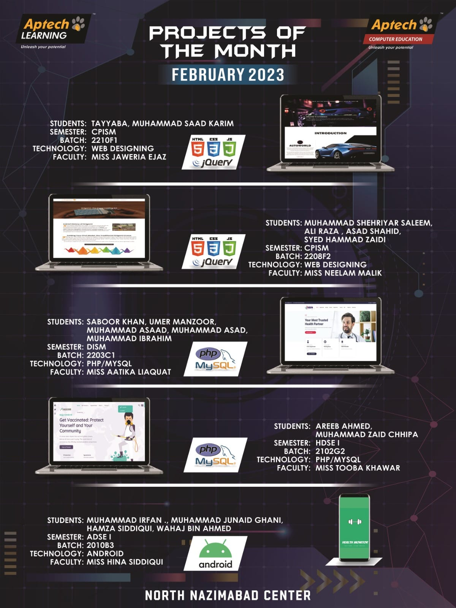

# First Web Design Project 🌐
## Overview
This web design project marks the start of my tech journey when I joined Aptech during my 1st semester. Created with HTML, CSS, Bootstrap, JavaScript, and jQuery, it was my first attempt at building something meaningful. Now, over two years later, at the end of my 4th semester, I’m finally sharing it.

This project also received the Project of the Month award at Aptech, making it even more special!

## Features
1. Responsive Design: Adapts to multiple screen sizes.
2. Bootstrap Layout: Built with clean grid systems.
3. Dynamic Content: Added interactivity using jQuery.
4. Modern UI: A simple yet effective layout design.

##Achievement
🏆 Project of the Month at Aptech, recognizing it as a standout project.

##Project Screenshots

##Technologies Used
1. HTML
2. CSS
3. Bootstrap
4. JavaScript
5. jQuery
